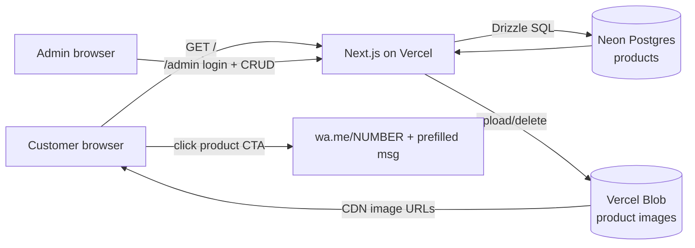

# Lume — Landing Page Design Specification

**Date:** 2026-06-10 · **Status:** Proposed (awaiting approval before implementation)

## 1. Overview

A landing page for **Lume**, a store selling rings (anéis) and bracelets (pulseiras).
It is **not an e-commerce**: every product CTA redirects the customer to the store's
WhatsApp. An admin area lets the store owner manage the product catalog.

**In scope**
- Public landing page with two tabs: *Anéis* and *Pulseiras*
- Product cards: title, description, material, image
- WhatsApp redirect with a prefilled message per product
- Admin area: login + CRUD for products (including image upload)
- Hosting on Vercel

**Out of scope** (explicitly not requested)
- Cart, checkout, payments, orders, stock
- Multi-admin / roles / user accounts
- The mockup's extra sections (testimonials, Instagram feed, "3 passos", best-sellers
  carousel) — the mockup is used as a **visual style reference only**. They can be
  added later if requested.

## 2. Tech Stack

| Concern | Choice | Rationale |
|---|---|---|
| Framework | Next.js 15 (App Router, TypeScript) | Requested; first-class on Vercel |
| Styling | Tailwind CSS | Fast to match the mockup's design system |
| Database | Postgres via **Neon** (Vercel Marketplace integration) | Free tier, zero-ops, native Vercel integration |
| ORM | Drizzle | Type-safe, near-zero overhead for one table |
| Image storage | **Vercel Blob** | Admin uploads images; served via CDN, works with `next/image` |
| Admin auth | Single password (`ADMIN_PASSWORD` env) + signed HTTP-only session cookie | One admin; simplest secure option — no auth provider needed |
| Mutations | Next.js Server Actions | No separate API layer needed for admin CRUD |
| Fonts | Cormorant Garamond (display) + Inter (body) via `next/font` | Matches the mockup's serif/sans pairing |

### Alternative considered: headless CMS (Sanity / Contentful)

Would eliminate the custom admin UI and database entirely — the admin edits products
in the CMS dashboard. Trade-off: external dependency, separate login portal, and a
generic editing UI instead of one tailored to the 4 product fields.
**Recommendation: custom admin** — the catalog is one entity with 4 fields, so the
custom admin is ~2 small pages and keeps everything in one deployable unit. Say the
word if you prefer the CMS route and this doc will be revised.

## 3. Architecture



- The public page is a **server component** that queries Postgres, cached with
  `revalidateTag('products')`; admin mutations call `revalidateTag` so the landing
  page updates immediately after an edit.
- WhatsApp redirect is a plain link — no server involvement:
  `https://wa.me/<NUMBER>?text=Olá! Tenho interesse no(a) <title> 😊`

## 4. Data Model

One table. Category is constrained to the two tabs.

```sql
CREATE TYPE category AS ENUM ('ring', 'bracelet');

CREATE TABLE products (
    id          SERIAL PRIMARY KEY,
    category    category    NOT NULL,
    title       TEXT        NOT NULL,
    description TEXT        NOT NULL,
    material    TEXT        NOT NULL,          -- e.g. "Prata 950"
    image_url   TEXT        NOT NULL,          -- Vercel Blob URL
    sort_order  INTEGER     NOT NULL DEFAULT 0,
    created_at  TIMESTAMPTZ NOT NULL DEFAULT now()
);
```

`sort_order` exists only so the admin controls display order (lowest first,
ties broken by `created_at`). No other attributes until requested.

## 5. Routes & Pages

| Route | Access | Purpose |
|---|---|---|
| `/` | Public | Landing page with hero + tabbed catalog |
| `/admin` | Cookie-gated | Product list with edit/delete; "new product" form |
| `/admin/login` | Public | Password form → sets session cookie |

Gating: `middleware.ts` checks the signed cookie on `/admin/*` (except
`/admin/login`) and redirects to the login page when absent/invalid.

**Server Actions** (replace a REST API): `login`, `logout`, `createProduct`,
`updateProduct`, `deleteProduct` — each mutation revalidates the `products` tag;
create/update accept a `File` and push it to Vercel Blob; delete also removes
the blob.

## 6. Public Page — Structure & Components

```
<Header>            sticky; LUME wordmark (serif, letter-spaced) — no nav links needed
<Hero>              full-width; headline + subline + primary WhatsApp button
<CatalogSection>
  <Tabs>            "ANÉIS" | "PULSEIRAS"  (client component, useState; no routing)
  <ProductGrid>     responsive: 1 col mobile / 2 tablet / 4 desktop
    <ProductCard>   image (4:5, next/image) · title · material (small caps,
                    muted) · description · [Falar no WhatsApp →] button
<Footer>            LUME mark · tagline · WhatsApp link · © year
```

- Both categories are fetched server-side in one query; tab switching only toggles
  which list renders (instant, no refetch).
- All copy in **pt-BR**, matching the mockup. Suggested hero copy (placeholder,
  owner can change): *"O símbolo perfeito para o seu amor"* + WhatsApp CTA
  *"Falar no WhatsApp"*.
- Empty tab state: "Em breve novos modelos. Fale conosco no WhatsApp."

## 7. Admin Page — Structure

```
/admin/login        centered card: password field + "Entrar"
/admin              header with "Sair" (logout)
                    [+ Novo produto] button → form (modal or inline section)
                    table/list of products: thumbnail, title, category,
                    material, sort_order · [Editar] [Excluir]
Form fields:        categoria (select: Anel/Pulseira) · título · descrição
                    (textarea) · material · imagem (file input, preview) · ordem
```

Delete asks for confirmation. Validation is minimal: all fields required,
image required on create (kept on update if no new file chosen).

## 8. Visual Design System (from `design/lume_design.jpeg`)

| Token | Value | Usage |
|---|---|---|
| `cream` | `#F4EFE8` | page background |
| `cream-dark` | `#EAE2D6` | section alternation, card background |
| `brown` | `#7A5C3E` | primary buttons, headings accent |
| `brown-dark` | `#5C4630` | hero headline, footer background |
| `ink` | `#3D3528` | body text |
| `muted` | `#8C8273` | material label, captions |
| `line` | `#D9CFC0` | card borders, dividers |

- **Typography:** Cormorant Garamond for the wordmark, hero headline and section
  titles (uppercase, wide tracking, occasional italic accent as in "AMOR");
  Inter for body, labels and buttons.
- **Buttons:** primary = filled `brown`, white text, slight radius, arrow suffix;
  secondary = outlined on cream (used for the hero's WhatsApp button styling in
  the mockup — here WhatsApp **is** the primary action, so primary filled).
- **Cards:** cream-dark background, 1px `line` border, generous padding,
  no shadows — flat and airy like the mockup.
- **Tabs:** uppercase, letter-spaced labels; active tab underlined in `brown`.

## 9. Configuration (Vercel env vars)

| Variable | Purpose |
|---|---|
| `DATABASE_URL` | Neon Postgres (set by the Vercel integration) |
| `BLOB_READ_WRITE_TOKEN` | Vercel Blob (set by Vercel) |
| `ADMIN_PASSWORD` | Admin login password |
| `SESSION_SECRET` | HMAC key for signing the session cookie |
| `NEXT_PUBLIC_WHATSAPP_NUMBER` | Store number, intl. format e.g. `5511987654321` |

## 10. Deployment

1. Create the Vercel project from the Git repo (framework auto-detected).
2. Add the Neon Postgres and Blob integrations from the Vercel dashboard.
3. Set `ADMIN_PASSWORD`, `SESSION_SECRET`, `NEXT_PUBLIC_WHATSAPP_NUMBER`.
4. Run the Drizzle migration (one-time, via `drizzle-kit push`).
5. Every push to `main` deploys automatically.

## 11. Open Questions (needed before/at implementation)

1. **Store WhatsApp number** — required for the CTA links.
2. **Hero copy & tagline** — placeholders proposed in §6; confirm or supply.
3. **Custom admin vs. headless CMS** — recommendation is custom admin (§2).
